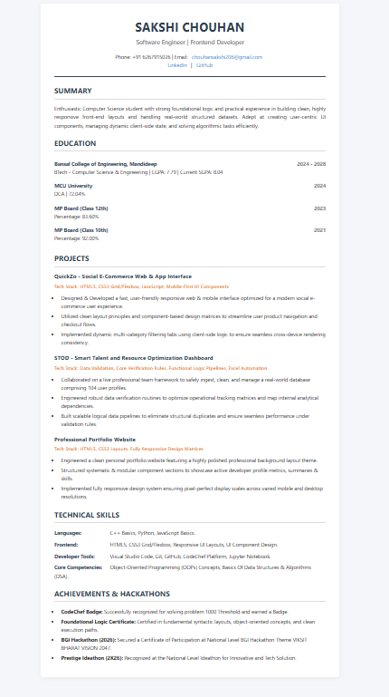

# 📄 HTML Resume (Digital CV)

A structured, clean, and semantic digital resume built using HTML and CSS. This project represents my foundational web development skills, showcasing my academic background, technical skills, and coding achievements.

---

## 📸 Live Preview
Here is how my digital resume looks:

---

## 🎯 Project Features
* **Semantic HTML5:** Built using clean and accessible tags (`<header>`, `<section>`, `<article>`).
* **Professional Layout:** Structured seamlessly using CSS to make it highly readable for recruiters.
* **Core Highlights:** Direct links to my programming skills (C++, Python), projects, and competitive programming milestones.

## 🛠️ Tech Stack Used
* **HTML5** - Layout and structure
* **CSS3** - Typography, spacing, and styling

